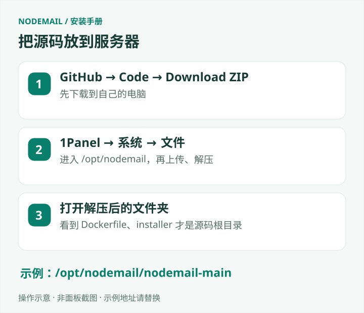
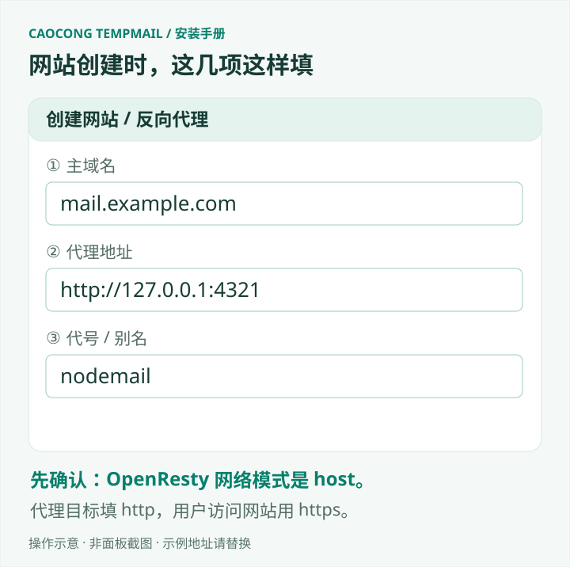
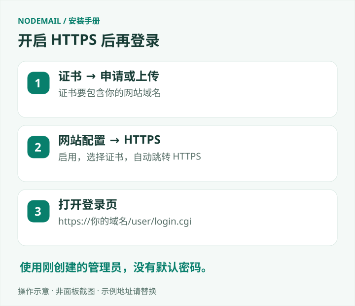

# 用 1Panel 搭建 草丛临时邮箱（新手教程）

[返回项目首页](../README.md)

**按顺序完成：上传源码 → 启动程序 → 绑定域名 → 登录后台 → 配置收信。**

适用于全新安装、1Panel v2 和同一台 Linux 服务器。不同版本菜单文字可能略有区别。当前没有 草丛临时邮箱 应用商店一键安装包，需要在面板的服务器终端复制几段命令。

> 当前仓库仍为私有预览，下载需要仓库访问权限。本文已对照安装代码和 1Panel 官方文档核对，尚未完成真实 1Panel 环境的逐屏安装验收。

## 先准备好

- 一台已安装 1Panel 的 Linux 服务器，能在面板终端以 root 或具备 Docker 权限的用户操作。
- 一个自己的域名，例如 `example.com`，能修改它的 DNS 解析。
- 本仓库的访问权限。没有权限时 GitHub 显示 404，不是服务器故障。

本文的示例请统一替换：

| 示例 | 换成你的什么信息 |
| --- | --- |
| `mail.example.com` | 用户打开网站的域名 |
| `mx.example.com` | 接收邮件的服务器域名 |
| `admin@example.com` | 你的联系邮箱、管理员登录邮箱；建议用已有可收信邮箱 |

网站、数据库和账号都在你自己的服务器。安装不带作者的用户、邮件或密码。

## 第 1 步：在面板准备环境

打开 **应用商店**，搜索并安装 **OpenResty**。已经安装的直接使用，不要卸载重装。它负责让用户通过域名访问网站。

打开 **终端**，连接这台服务器，进入 Bash。这里是服务器终端，不是某个容器的终端，也不是自己电脑的 PowerShell。

逐条执行：

```bash
docker info
docker compose version
node --version
```

**成功标准：** Docker 没有连接或权限错误；Compose 是 v2 且支持 `up --wait`；Node.js 是 22.12 或更新版本。

如果提示 `node: command not found`，先按 [Node.js 官方下载页](https://nodejs.org/en/download)的 Linux 安装说明，在这个服务器终端安装满足要求的 LTS 版本，再重新检查。仅在 1Panel 创建 Node.js 运行环境，不代表服务器终端已经能使用 `node`。Docker 缺失时参考 [Docker 官方安装说明](https://docs.docker.com/engine/install/)。

**不用在应用商店再装 MySQL。** 后面的安装工具会创建本项目自己的数据库。

## 第 2 步：下载并上传源码



1. 在电脑浏览器登录 GitHub，打开 [草丛临时邮箱 仓库](https://github.com/Aoliao-aoliao/nodemail)。
2. 点击绿色 **Code → Download ZIP**，下载源码压缩包。
3. 回到 1Panel，打开 **系统 → 文件**（部分版本直接叫“文件”）。
4. 进入 `/opt`，新建文件夹 `nodemail`，进入后点击 **上传**，选刚下载的 ZIP。
5. 上传完成，选中 ZIP，点击 **解压**，解压到当前目录。

下载 main 分支时，通常会得到 `/opt/nodemail/nodemail-main`。点进去，应能看到 `Dockerfile`、`package.json`、`installer`、`server`。如果多套了一层文件夹，以下命令的路径应改为真正含有 `Dockerfile` 的那层。

不要把源码上传到公开网站目录，也不要覆盖旧站目录。

## 第 3 步：把程序运行起来

回到 **终端**。每段成功后再执行下一段，遇到报错先停止。

### 3.1 构建程序

```bash
cd /opt/nodemail/nodemail-main
docker build -t nodemail-local:0.0.1 .
```

这一步会下载依赖，需要等待。最后没有 `ERROR`，并完成镜像导出/命名，才继续。`nodemail-local:0.0.1` 是本机程序版本名称，保持原样即可。

### 3.2 填域名，创建自己的数据库

先进入安装目录：

```bash
cd /opt/nodemail/nodemail-main/installer
```

把下面的域名和邮箱换成自己的，再复制整段执行。每行末尾的 `\` 表示命令尚未结束，末尾不要加空格。

```bash
node manage.mjs configure \
  --image nodemail-local:0.0.1 \
  --site https://mail.example.com \
  --public https://mail.example.com \
  --contact admin@example.com \
  --mx mx.example.com
```

这条命令成功时可能没有输出，会生成 `installer/.env`，里面保存本次安装的密码和密钥。**保留它，不要公开或重新生成。** 然后执行：

```bash
node manage.mjs init
```

**成功标准：** 数据库启动并完成初始化，命令正常结束，没有错误。这里只初始化全新的空数据库，不用于更新旧站。

### 3.3 创建管理员并启动

先复制下面两行，回车后输入自己设置的密码（至少 12 位），再按回车。输入时没有星号或文字是正常的。

```bash
read -r -s -p '请输入管理员密码（至少12位）: ' NODEMAIL_ADMIN_PASSWORD
printf '\n'
```

把下方邮箱换成你的管理员邮箱，再执行：

```bash
printf '%s' "$NODEMAIL_ADMIN_PASSWORD" | node manage.mjs bootstrap --email admin@example.com
unset NODEMAIL_ADMIN_PASSWORD
```

管理员创建成功后执行：

```bash
node manage.mjs start
```

**成功标准：** 命令正常结束；在 **容器 → 容器** 中能看到本项目的 `app`、`db` 容器运行且健康（名称含随机生成的 `nodemail-…` 前缀）。没有默认管理员密码。

## 第 4 步：让域名打开你的网站

### 4.1 添加域名解析

去域名服务商的 DNS 管理页面，添加下面这条记录：

| 类型 | 主机记录 | 记录值 |
| --- | --- | --- |
| A | `mail` | 这台服务器的公网 IPv4 |

示例对应 `mail.example.com`。初次安装建议先用纯 DNS 解析，网站正常后再按需配置 CDN。服务器安全组和系统防火墙允许网站使用的 TCP **80、443**；不需要开放 **4321、3306**。

### 4.2 先确认 OpenResty 的网络

在 **容器 → 容器** 找到 OpenResty，查看详情中的网络模式，应为 **host**。也可以复制其实际容器名，在终端查询（把“实际容器名”替换掉）：

```bash
docker inspect --format '{{.HostConfig.NetworkMode}}' 实际容器名
```

只有结果是 `host`，才按下一节填写 `127.0.0.1`。如果是 `bridge` 或其他网络，本教程的代理地址不能直接使用，需要先按实际容器网络设计连接方式；不要为了修复 502 将 4321 开到公网，也不要贸然修改已有 OpenResty 的网络，避免影响其他网站。

### 4.3 在 1Panel 创建网站



打开 **网站 → 创建网站 → 反向代理**，按下表填写：

| 页面上的项目 | 怎么填 |
| --- | --- |
| 主域名 | `mail.example.com`，不带 `https://` |
| 其他域名 | 先留空 |
| 代理地址 | `http://127.0.0.1:4321` |
| 代号/别名 | `nodemail`，若已占用则换一个 |
| 备注 | 自己的邮箱网站 |

点击确认。这里选择的是“反向代理”，不要选择静态网站或 PHP 网站。

打开这个网站的 **配置 → 反向代理**，编辑刚创建的代理规则。使用规则的配置编辑入口核对以下内容；不同版本可能显示为“配置文件”。在已有的 `location /` 中修改对应项，**不要再新增第二个 `location /`，也不要用下面片段覆盖整个网站配置文件**：

```nginx
location / {
    proxy_pass http://127.0.0.1:4321;
    proxy_set_header Host $http_host;
    proxy_set_header X-Forwarded-Host $http_host;
    proxy_set_header X-Forwarded-Proto $scheme;
    proxy_set_header X-Forwarded-For $remote_addr;
    proxy_set_header X-Real-IP $remote_addr;
}
```

这些设置让程序正确识别你的域名、HTTPS 和访问者 IP。同名请求头在该规则内只保留一条设置，关闭反向代理缓存。保存时如果面板提示配置校验失败，先修正错误再应用，不要重启整个 OpenResty 碰运气。

### 4.4 开启 HTTPS



在面板 **证书 / SSL 证书** 中为 `mail.example.com` 申请证书，或上传已有的有效证书。申请方式按面板提示完成域名验证；证书必须包含你的网站域名。

返回 **网站 → 该网站的配置 → HTTPS**，启用 HTTPS，选择这张证书，将 HTTP 选项设为 **自动跳转 HTTPS**，保存。

**成功标准：** 浏览器打开 `https://mail.example.com/user/login.cgi` 能看到登录页面，证书有效，没有安全警告。

## 第 5 步：登录后台，配置收信

用第 3 步创建的邮箱和密码登录，再打开：

```text
https://你的域名/admin/
```

**网站能打开还不等于能收邮件。** 按需要选一种收信方式：

| 你想怎样使用 | 接下来做什么 |
| --- | --- |
| 用自己的域名收信 | 后台添加收信域名；添加下方 DNS 记录；允许入站 TCP 25 |
| 接入已有邮箱 | 后台配置中继邮箱，用自己的 IMAP 凭据或 OAuth 授权，再检测连接 |

例如要收 `任意名字@example.com` 的邮件：

| 类型 | 主机记录 | 记录值 | 优先级 |
| --- | --- | --- | --- |
| A | `mx` | 服务器公网 IPv4 | 不填 |
| MX | `@` | `mx.example.com` | 10 |

`mx` 记录只能用于 DNS 解析，不能开启普通 HTTP CDN 代理。云服务器厂商还需要允许入站 TCP 25。若已有邮件服务，不要直接替换原 MX；可选择单独的收信子域名并在后台添加同一个子域名。仅使用中继收信时，不必为自有域名开放 25；可将 `.env` 中 `SMTP_BIND` 改为 `127.0.0.1` 后执行 `node manage.mjs start`。

开放用户注册前，在后台安全设置中配置自己的 Turnstile 验证码。支付、第三方登录也需要填自己的服务商信息，不会自动接入作者账号。

## 遇到问题，先看这里

| 看到的现象 | 先检查什么 |
| --- | --- |
| GitHub 404 / 无法下载 | 当前仓库私有，登录有访问权限的 GitHub 账号 |
| `node: command not found` | 在服务器主机安装 Node.js，不是只安装容器内运行环境 |
| 找不到 Dockerfile / manage.mjs | 当前目录不对，按第 2 步确认解压路径 |
| 25 端口被占用 | 检查服务器原有邮件服务；不要直接停止其他项目 |
| 提示 `.env` 已存在 | 说明已配置过，不要删除重建；回到对应步骤继续 |
| 初始化提示数据库不为空 | 不再初始化，不删除数据；先确认是否误用了旧环境 |
| 网站显示 502 | 看 app 容器健康和日志，再核对 OpenResty 网络模式、代理端口 |
| 网站显示 421 | 网站域名须与配置一致，核对 Host 和 X-Forwarded-Host |
| 登录后又回登录页 | 确认 HTTPS、转发的协议头，并关闭网站/CDN 缓存 |
| 能登录但收不到邮件 | 检查后台收信配置、MX、入站 25 或中继连接状态 |

在 **容器 → 容器 → 本项目 app/db → 日志** 查看具体错误。分享日志前遮住密码、令牌、邮件内容；不要直接分享 `.env`。

## 以后更新、备份怎么办？

后台“检查更新”只提醒有新版本，不会自动改动程序。按 [更新教程](UPGRADING.md) 操作，**不要重新执行 `init`，也不要用新 ZIP 覆盖正在使用的安装目录**。

需要保留：`installer/.env`、`.active-image`（如有）、自己的数据库、附件数据卷，以及使用中的 TLS 文件。1Panel 的网站目录备份不等于已经备份 Docker 数据卷。不要勾选“删除数据卷”来重建服务。

## 官方参考与验证范围

- [1Panel：文件上传与解压](https://1panel.pro/docs/v2/user_manual/system/file/)
- [1Panel：服务器终端](https://1panel.pro/docs/v2/user_manual/terminal/)
- [1Panel：创建反向代理网站](https://1panel.pro/docs/v2/user_manual/websites/website_create/)
- [1Panel：代理设置与 HTTPS](https://1panel.pro/docs/v2/user_manual/websites/website_config_basic/)
- [1Panel 维护者对 OpenResty host 网络的说明](https://github.com/1Panel-dev/1Panel/discussions/6115)；实际安装仍以容器详情为准。
- [本项目安装与隔离测试范围](VALIDATION.md)。本教程不代表已完成真实面板部署测试。

---

Copyright © 2026 草丛（Aoliao-aoliao） · 草丛临时邮箱
