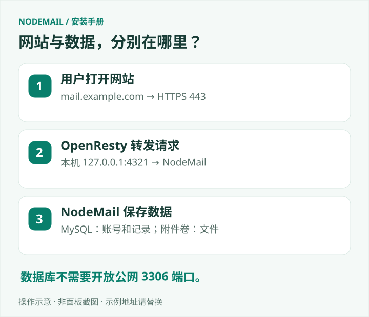

# 先了解 NodeMail

NodeMail 是一个放在自己服务器上运行的网页邮箱。用户通过网页申请邮箱、查看邮件和附件；管理员负责域名、中继账号、用户和站点设置。

如果你只是想先搭起来，直接从 [准备服务器与域名](PREPARATION.md) 开始。用 1Panel 的读者接着看 [面板搭建教程](1PANEL.md)。

## 它由哪些部分组成？

网站负责显示和操作，SMTP 或中继负责接收邮件，MySQL 保存用户和邮件记录，附件单独存放。浏览器关闭后，服务器上的服务仍会运行。

有两种收信方式。你可以给自己的域名设置 MX，让邮件直接送到服务器；也可以接入自己有权使用的上游邮箱，由中继任务读取邮件。两种方式的准备工作不同，详见 [域名与收信](MAIL-GUIDE.md)。

## 新安装里有什么？

安装工具会创建空数据库及默认配置，随后由你设置第一个管理员。没有默认管理员密码，也不带作者网站的用户、邮件、积分和订单。

会员档位和价格是起始模板，管理员可以调整。支付渠道、第三方登录和中继账号需要填写自己的资料后才能使用。部署同一份程序，不代表与作者共用服务商账户。

## 当前做到哪一步了？

现在是完整前后端源码的私有预览，尚未正式公开发行，许可证还在确认。仓库中没有公开镜像下载地址，当前安装方式是在自己的服务器从源码构建。

Telegram 目前只完成账号绑定，没有邮件推送、通知或登录功能。后台更新提示不会自动替换程序。涉及数据库结构变化的升级也不能直接套用现有升级命令。

这些限制会在对应教程里再说明。已经完成的自动化检查和未覆盖的实际场景，见 [测试与功能边界](VALIDATION.md)。

## 文档怎么读？

| 你现在的情况 | 先看这篇 |
| --- | --- |
| 只有服务器，还没开始装 | [准备服务器与域名](PREPARATION.md) |
| 已装好 1Panel | [1Panel 图文搭建](1PANEL.md) |
| 习惯用 SSH 命令行 | [Linux 安装](BEGINNER.md) |
| 能登录，接下来不知道配什么 | [第一次进入后台](ADMIN-GUIDE.md) |
| 网页正常，但收不到邮件 | [域名与收信](MAIL-GUIDE.md) |
| 想升级又怕数据丢失 | [更新与恢复](UPGRADING.md)、[备份](BACKUP.md) |

文档里的 `example.com` 和邮箱地址都是示例。填配置时换成自己实际使用的信息，不要照抄示例域名。
